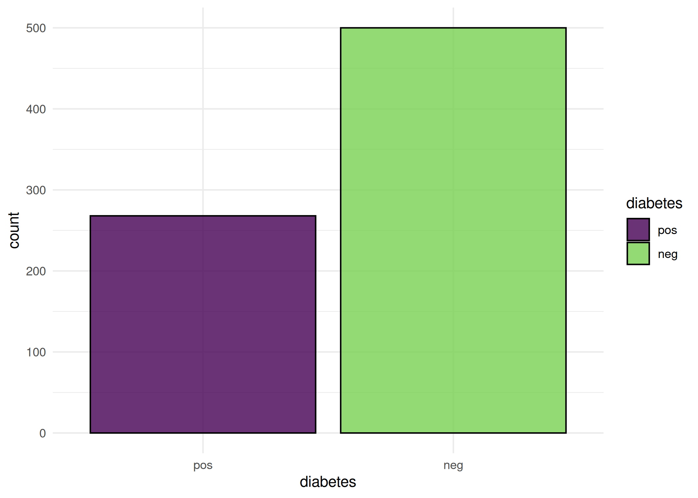
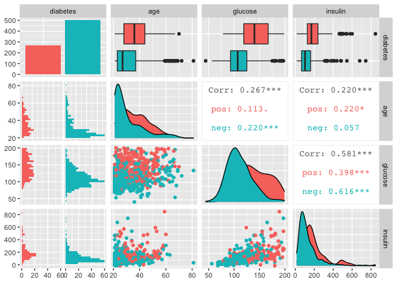

# mlr3viz

Package website: [release](https://mlr3.mlr-org.com/) |
[dev](https://mlr3.mlr-org.com/dev/)

<!-- badges: start -->

[](https://github.com/mlr-org/mlr3viz/actions)
[](https://cran.r-project.org/package=mlr3viz)
[](https://codecov.io/gh/mlr-org/mlr3viz)
[](https://stackoverflow.com/questions/tagged/mlr3)
<!-- badges: end -->

This R package provides visualizations for
[mlr3](https://mlr3.mlr-org.com) objects such as tasks, predictions,
resample results or benchmark results via the `autoplot()` generic of
[ggplot2](https://ggplot2.tidyverse.org/).

## Installation

Install the last release from CRAN:

``` r
install.packages("mlr3")
```

Install the development version from GitHub:

``` r
remotes::install_github("mlr-org/mlr3viz")
```

## Short Demo

``` r
library(mlr3)
library(mlr3viz)

task = tsk("pima")$select(c("age", "glucose", "insulin"))
learner = lrn("classif.rpart", predict_type = "prob")
rr = resample(task, learner, rsmp("cv", folds = 10))

# Default plot for task
autoplot(task)
```

<!-- -->

``` r
# Pairs plot from GGally
autoplot(task, type = "pairs")
```

<!-- -->

``` r
# ROC curve for the ResampleResult
autoplot(rr, type = "roc")
```

<!-- -->
