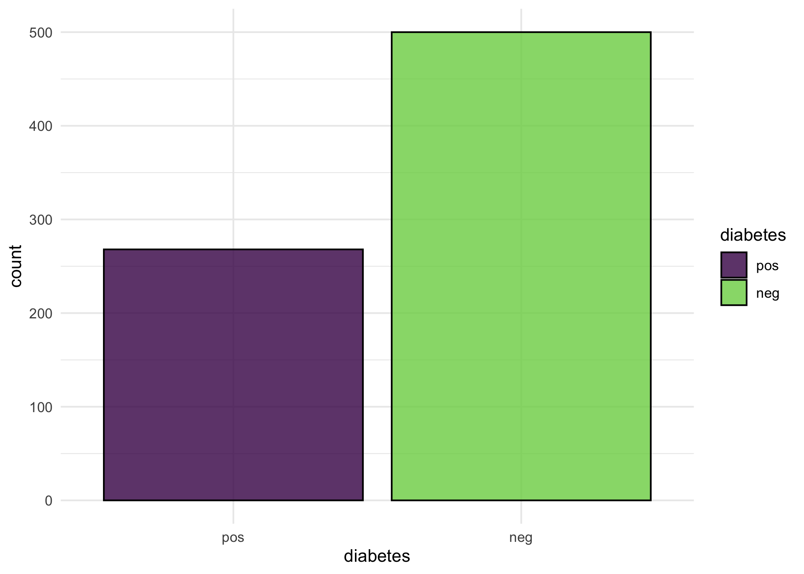
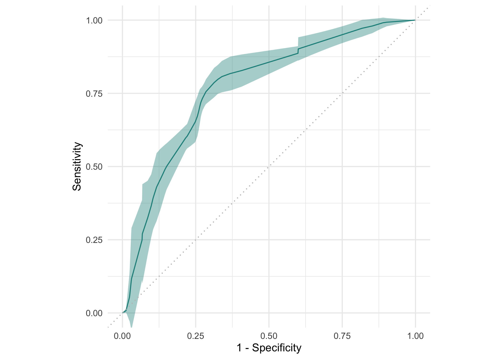

# mlr3viz

Package website: [release](https://mlr3viz.mlr-org.com/) \|
[dev](https://mlr3viz.mlr-org.com/dev/)

*mlr3viz* is the visualization package of the
[mlr3](https://mlr-org.com/) ecosystem. It features plots for mlr3
objects such as tasks, learners, predictions, benchmark results, tuning
instances and filters via the
[`autoplot()`](https://ggplot2.tidyverse.org/reference/autoplot.html)
generic of [ggplot2](https://ggplot2.tidyverse.org/). The package draws
plots with the [viridis](https://CRAN.R-project.org/package=viridisLite)
color palette and applies the [minimal
theme](https://ggplot2.tidyverse.org/reference/ggtheme.html).
Visualizations include barplots, boxplots, histograms, ROC curves, and
Precision-Recall curves.

The [gallery](https://mlr-org.com/gallery/technical/2022-12-22-mlr3viz/)
features a **showcase post** of the plots in `mlr3viz`.

## Installation

Install the last release from CRAN:

``` r
install.packages("mlr3")
```

Install the development version from GitHub:

``` r
# install.packages("pak")
pak::pak("mlr-org/mlr3viz")
```

## Resources

The [gallery](https://mlr-org.com/gallery/technical/2022-12-22-mlr3viz/)
features a showcase post of the visualization functions `mlr3viz`.

## Short Demo

``` r
library(mlr3)
library(mlr3viz)

task = tsk("pima")
learner = lrn("classif.rpart", predict_type = "prob")
rr = resample(task, learner, rsmp("cv", folds = 3), store_models = TRUE)

# Default plot for task
autoplot(task, type = "target")
```



``` r
# ROC curve for resample result
autoplot(rr, type = "roc")
```



For more example plots you can have a look at the [pkgdown
references](https://mlr3viz.mlr-org.com/reference/index.html) of the
respective functions.
